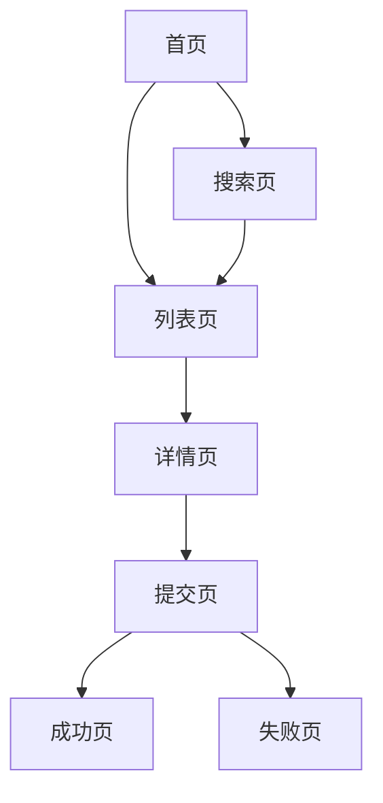

# L2-modules.md 模板（项目工程指南）

> **用途说明**：本模板用于生成 L2 层唯一输出文件 `L2-modules.md`，汇总项目所有业务模块的工程知识。不拆分为多个文件。

> **用途说明**：本模板用于生成 **`project-engineering-guide.md`**（项目工程指南），这是 L2 层的核心输出文件。该文件汇总项目**所有业务模块**的工程知识，每个模块必须包含「功能说明」和「接口说明」两个核心章节。生成时严格遵循本模板的章节结构和格式要求。

> 本文档记录项目中 **AI 无法通过扫描代码获取** 的关键信息，包括技术决策、业务流程、开发经验和注意事项。

---

## 1. 业务流程概览

> **说明**: 描述核心业务流程和页面间关系，帮助理解整个应用的业务逻辑。

### 1.1 核心业务流程图


<!-- 备注：业务主 R 明确核心业务流程，使用 mermaid 语法绘制核心业务流程图， -->

### 1.2 关键业务规则

```
业务流程:
  - [流程名称]: [步骤1] → [步骤2] → [步骤3] → ...

```
<!-- 备注：特殊场景处理记录那些针对特定企业、用户群体的差异化逻辑 -->

---

## 2. 页面索引

> **说明**: 按功能模块分组列出所有页面，便于快速定位。

```
[模块名称]:
- [页面名称] ([路由]) - [一句话说明]
- [页面名称] ([路由]) - [一句话说明] - 有独立页面知识库

e.g.
核心页面:
- 首页 (/) - 核心入口
- 订单列表 (/order) - 用户历史订单

商品相关:
- 商品详情 (/product/:id) - 商品详情页
- 购物车 (/cart) - 购物车页面

用户相关:
- 个人中心 (/mine) - 个人中心入口
- 地址管理 (/address) - 收货地址管理
```
<!-- 备注：按功能模块分组（如核心页面、商品相关、用户相关、订单相关等），每个页面一行 -->

---

## 3. 复杂模块说明

> **说明**: 记录工程中复杂模块的核心逻辑和使用注意事项，简单模块可通过扫描代码获取。每个模块必须包含「功能说明」和「接口说明」两个核心章节。

### 3.1 复杂通用组件

> **说明**: 聚焦全项目级别的通用组件，页面级组件在各页面知识库中记录。

```
[ComponentName] ([组件路径]) - [组件用途]

  【功能说明】
  职责概述: [该组件的整体定位和职责边界，1-3 句话说清楚它解决什么问题]
  核心能力:
    - [能力1]: [说明]
    - [能力2]: [说明]
  封装原因: [为什么需要封装这个组件，不直接用原生或第三方库]
  核心逻辑:
    - [核心方法/处理流程1]: [说明]
    - [核心方法/处理流程2]: [说明]

  【接口说明】
  Props:
    - [propName]: [类型] - [说明] - 默认值: [defaultValue]
    - [propName]: [类型] - [必填] - [说明]
  Events/Callbacks:
    - [eventName]: ([参数类型]) => void - [触发时机和用途]
  Slots/Children:
    - [slotName]: [说明]（如无可省略）
  Ref 方法（如有暴露）:
    - [methodName]([参数]): [返回值] - [说明]

  注意事项: [使用限制或注意点]
  已知问题: [已知的 bug 或兼容性问题]
```
<!-- 备注（可选）：只记录全项目复用的复杂组件，页面级组件不在此记录，组件数量不超过 5 个 -->


### 3.2 复杂工具函数/Hooks

```
[函数/Hook名称] ([文件路径]) - [用途]

  【功能说明】
  职责概述: [该函数/Hook 解决什么问题，为什么需要封装]
  封装原因: [不直接写在页面的原因，如复用性/复杂度/副作用管理]
  核心逻辑: [关键处理步骤或算法说明]
  边界情况: [空值/异常/边界输入的处理方式]

  【接口说明】
  签名: [functionName(param1: Type, param2?: Type): ReturnType]
  参数:
    - [paramName]: [类型] - [说明]
  返回值: [类型] - [说明]
  副作用: [是否有副作用，如修改全局状态、发起请求等]
  依赖项（Hook）: [useEffect/useMemo 等的依赖项说明]

  注意事项: [使用限制，如只能在特定场景使用]
```
<!-- 备注（可选）：只记录复杂的工具函数和 Hooks -->

### 3.3 全局状态设计

```
[状态模块名] ([文件路径]) - [设计目的]

  【功能说明】
  职责概述: [该状态模块管理什么数据，覆盖哪些业务场景]
  设计原因: [为什么需要全局状态，不放在页面级的原因]
  核心状态:
    - [stateKey]: [类型] - [说明，包含初始值和更新时机]
  核心方法/Actions:
    - [actionName]([参数]): [说明，触发条件和副作用]
  同步机制: [状态如何在不同组件间同步，是否有跨 tab/跨页面同步]
  持久化: [是否持久化，持久化原因和实现方式（localStorage/sessionStorage/cookie）]

  【接口说明】
  对外暴露（供组件使用）:
    - [选择器/selector 或 useXxxStore 方法]: [返回类型] - [说明]
  触发方式:
    - [dispatch(action) / store.set() / useXxxStore().update 等]: [说明]
  订阅方式（如有）:
    - [说明如何监听状态变化]

  注意事项: [使用时的注意点，如并发更新、循环依赖等]
```
<!-- 备注（可选）：这部分需要梳理工程中所有的全局状态 -->

---

## 4. 工程级注意事项

> **说明**: 记录工程级别的配置、部署、第三方服务等注意事项，这些信息分散在代码各处，难以通过扫描获取。主 R 等开发人员可自行补充

### 4.1 开发与部署

```
[配置项]: [说明]

构建配置: Nine.js 需要配置 externals 排除 @company/sdk，否则打包体积过大
```
<!-- 备注（可选）：工程本地开发代理配置等， -->

### 4.2 第三方服务

```
[服务名称]: [注意事项]

Mach组件系统: 点菜页使用动态渲染，需在页面初始化时注册自定义组件
```
<!-- 备注（可选）：记录该工程特有的第三方服务 -->


### 4.3 历史问题与技术债务

```
[问题名称]:
  影响范围: [受影响的模块/页面]
  说明: [问题的具体描述和背景]
  临时方案: [当前的处理方式]
  注意: [开发时需要注意的点]

e.g.
Vue/React混合架构:
  影响范围: 整个项目
  说明: src/ 为 Vue 旧代码，src_new/ 为 React 新代码
  临时方案: 新功能在 src_new/ 开发，旧功能按需迁移
  注意: 通过 vuera 实现混合，部分页面仍在 Vue 中
```
<!-- 备注（可选）：记录历史遗留问题和技术债务，帮助后续维护者了解背景，避免踩坑 -->

---

## 5. 目录结构约定（可选）

> **说明**: 如有特殊的目录结构约定，在此记录。常规目录结构可通过扫描代码获取。

```
[约定]: [说明]

页面级组件: 放在 pages/xxx/components/，不要放到 src/components/
页面级状态: 放在 pages/xxx/store/，使用 rematch model 格式
多环境配置: config/env/ 目录下，根据 NODE_ENV 自动加载
```
<!-- 备注（可选）：只记录特殊的目录约定，常规结构可省略本章节 -->

---

## 6. 容器环境适配（可选）

> **说明**: 如项目运行在多种容器环境中（App WebView、小程序、H5 等），在此记录各环境的差异和适配方式。

```
容器判断方法:
  - [判断函数名]: [容器说明]
  e.g.
  - isInTitans: Titans 容器（美团 App WebView）
  - isFeishu: 飞书容器
  - isInWechat: 微信 H5
  - isWXMiniProgram: 微信小程序

关键差异:
  - [容器名称]: [差异说明]
  e.g.
  - Titans 容器: 使用 MTSQT SDK，支持 openPage/closePage
  - 微信 H5: 部分接口需要微信授权

注意事项:
  - [场景]: [处理方式]
  e.g.
  - 页面关闭: Titans 用 closePage，H5 用 history.back
  - 用户信息: 不同容器获取方式不同
```
<!-- 备注（可选）：如项目只运行在单一环境，可省略本章节 -->

---