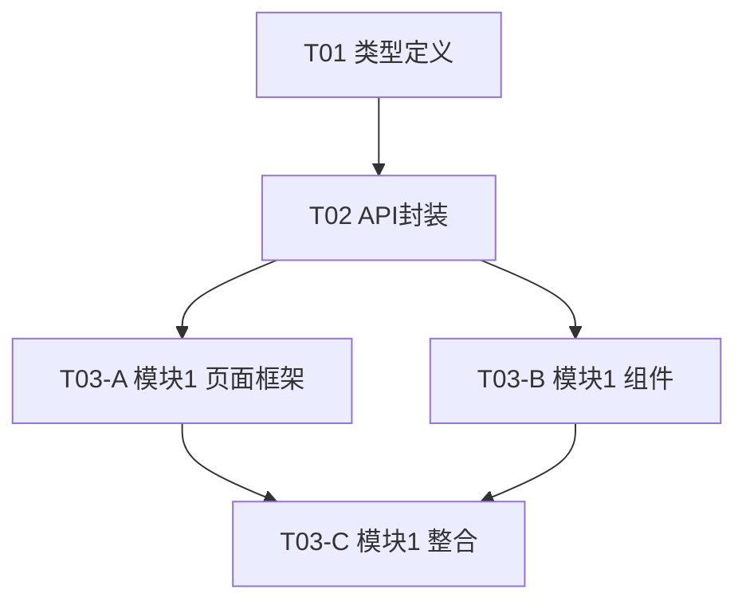

# {需求名称} - 开发任务清单

| 属性 | 值 |
|------|-----|
| **技术方案来源** | `{techdoc.md 路径}` |
| **设计稿列表** | `{设计稿1}`、`{设计稿2}` |
| **生成时间** | `{YYYY-MM-DD HH:mm:ss}` |
| **总任务数** | `{N}` |
| **已完成** | `{n} / {N}` |
| **整体进度** | `{X}%` |

---

## 布局规范约定（全局）

本项目所有任务必须遵守以下布局职责分离原则：

### 1. 组件与页面的职责划分

| 层级 | 职责 | 禁止事项 |
|------|------|---------|
| **组件** | 负责内部元素排列（flex/grid）、内部间距 | ❌ 不设外部 margin，不设固定宽度（除非明确需要） |
| **页面** | 负责组件间间距、组件位置、响应式断点 | ❌ 不侵入组件内部样式 |

### 2. 组件接口约定

- 所有业务组件必须接受 `className?: string` prop
- 组件默认宽度：`w-full`（撑满父容器）
- 组件默认不设 margin

### 3. 违反约定的后果

违反上述约定的代码将被视为**验收不通过**，必须修正后才能合并。

---

## 共享任务（跨模块共用）

| ID | 类型 | 标题 | 模块路径 | 被以下模块使用 | 预估工时 |
|----|------|------|---------|---------------|---------|
| T01 | types | {类型定义标题} | `src/types/` | 模块1, 模块2 | {X}h |
| T02 | api | {API 封装标题} | `src/api/` | 模块1, 模块2 | {X}h |

---

## 依赖关系图

---

## 模块 1：{模块1名称}

### 布局上下文

| 属性 | 值 |
|------|-----|
| 设计稿来源 | {设计稿路径} |
| 页面结构 | {整体结构描述} |
| 功能区域 | {区域列表} |
| 响应式断点 | {如有} |

### 区域详情

#### {区域名称，如：筛选区}

| 属性 | 值 |
|------|-----|
| 位置 | {在页面中的位置} |
| 与相邻区域间距 | {margin/padding 值} |
| 内部布局 | {flex/grid 详情} |
| 响应式行为 | {如有} |
| 布局职责 | 该区域作为独立组件时，负责内部布局；父页面负责外部间距 |

#### {区域名称，如：商品网格区}

| 属性 | 值 |
|------|-----|
| 位置 | {在页面中的位置} |
| 与相邻区域间距 | {margin/padding 值} |
| 内部布局 | {grid 列数、间距} |
| 响应式行为 | {列数变化} |
| 布局职责 | 该区域作为独立组件时，负责内部 grid 布局；父页面负责外部间距和响应式列数覆盖 |

### 任务清单

#### T{序号}: {任务标题}

| 字段 | 值 |
|------|-----|
| 类型 | {type} |
| 优先级 | {priority} |
| 状态 | `[ ]` |
| 模块 | {模块名称} |
| 布局职责 | {内部布局/外部布局/无} |
| 父页面控制 | {如适用} |
| 暴露接口 | {如适用} |
| 模块路径 | {module_path} |
| 依赖 | {depends_on} |
| 预估工时 | {X}h |
| 预估代码行数 | {Y} 行 |
| 开发建议 | {development_advice} |

**功能描述**

{description}

**验收标准**

- [ ] {acceptance_1}
- [ ] {acceptance_2}

**测试要求**

{test_requirements}

**备注**

{notes}

---

#### T{序号}: {任务标题}

...（重复上述结构）

---

## 模块 2：{模块2名称}

### 布局上下文

...（同上结构）

### 任务清单

...（同上结构）

---

## 开发顺序建议

根据依赖关系和优先级，建议按以下顺序开发：

### 第一阶段：共享基础（预计 {X}h）

- T01 - 类型定义
- T02 - API 封装

### 第二阶段：模块1（预计 {X}h）

- T03-A - 模块1 页面框架
- T03-B - 模块1 组件（可与 T03-A 并行）
- T03-C - 模块1 整合

### 第三阶段：模块2（预计 {X}h）

- T04-A - 模块2 页面框架
- T04-B - 模块2 组件
- T04-C - 模块2 整合

---

## 风险提示

| 风险类型 | 描述 | 影响任务 | 应对措施 |
|---------|------|---------|---------|
| 阻塞风险 | {描述} | T02, T03 | {措施} |
| 技术难点 | {描述} | T05 | {措施} |
| 待确认项 | {描述} | T04 | {措施} |

---

## 变更记录

| 日期 | 变更内容 | 操作人 |
|------|---------|--------|
| {YYYY-MM-DD} | 初始创建 | AI |
| {YYYY-MM-DD} | {变更描述} | {操作人} |
