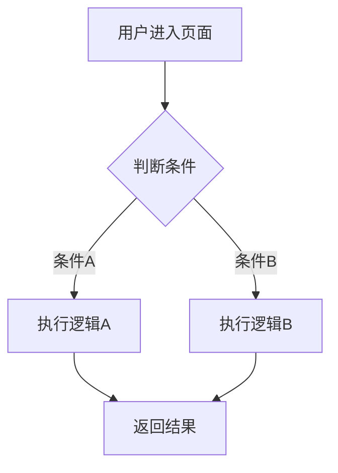
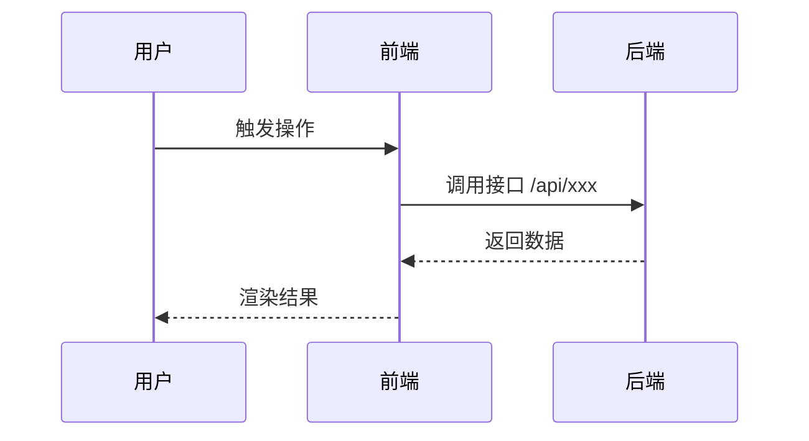

# (RFC001)【模板】{日期}-{需求名称}前端技术方案[COMMITTED]

> **说明**：本模版基于外卖大前端组标准技术方案格式（参考：https://km.sankuai.com/collabpage/2746696906）
> 状态标记：[COMMITTED] = 已确认方案 | [WIP] = 方案制定中 | [DRAFT] = 草稿

---

## 目录

1. 需求信息
   - 1.1 基本信息
   - 1.2 需求背景
   - 1.3 目标及收益
2. 详细设计
   - 2.1 功能设计
     - 2.1.1 流程图/时序图/泳道图/状态机图
     - 2.1.2 核心业务
     - 2.1.3 业务埋点
     - 2.1.4 通用能力沉淀
   - 2.2 自查 Checklist
   - 2.3 稳定性保障方案
     - 2.3.1 影响评估
     - 2.3.2 版控方案（可选）
     - 2.3.3 合规评估
     - 2.3.4 风控风险
     - 2.3.5 容灾容错方案（黄金链路必选）
     - 2.3.6 监控告警
     - 2.3.7 上线/灰度方案
     - 2.3.8 止损方案（含降级/回滚）
3. 工时评估
4. TODO

---

## 1. 需求信息

### 1.1 基本信息

| 角色 | 详细 | 地址/信息 |
|------|------|-----------|
| PM | PRD | {PRD链接} |
| Ones链接 | | {ONES工作项链接} |
| 灰度/AB方案 | | {灰度方案说明，如不涉及填"不涉及"} |
| 端支持 | | {勾选适用项：外卖App（仅H5）/ 美团App（仅H5）/ 点评App / 外卖微信小程序 / 美团微信小程序 / 惠省微信小程序} |
| 容器支持 | | {外投容器 / 标准KNB容器，说明差异} |
| 接口文档 | | {接口文档链接，如有多个接口可列表展示} |

### 1.2 需求背景

{描述需求的业务背景，为什么要做这个需求，解决了什么问题}

### 1.3 目标及收益

{描述本次需求的目标和预期收益，可以是业务指标、用户体验提升、技术债务清理等}

---

## 2. 详细设计

### 2.1 功能设计

#### 2.1.1 流程图/时序图/泳道图/状态机图

> 根据功能复杂度选择合适的图表类型，使用 Mermaid 语法绘制

**{功能点1} 流程图**



**{功能点2} 时序图**（如涉及多方交互）



#### 2.1.2 核心业务

> 按功能点逐一描述实现方案，要具体到技术实现层面

**{功能点1}：{功能名称}**

- **实现思路**：{描述具体实现方式，包括组件设计、状态管理、数据流向}
- **接口调用**：
  - 接口：`{HTTP方法} {接口路径}`
  - 文档：[接口文档链接](学城/F1API/PAPI链接)
  - 请求参数：`{参数名}（{类型}）：{说明}`
  - 响应处理：{描述如何处理响应数据，包括字段映射、数据转换}
  - 错误处理：{描述异常情况的处理逻辑，包括业务异常码处理}
- **关键代码逻辑**：{如有复杂逻辑，用伪代码或代码片段说明}
- **边界情况**：{列出需要特殊处理的边界情况}

**示例**：

```
**获取用户信息接口调用**：
- 接口：`GET /api/v1/user/info`
- 文档：[学城文档](https://km.sankuai.com/page/123456)
- 请求参数：
  - `userId`（string）：用户ID，必填
  - `type`（number）：查询类型，选填，默认为1
- 响应处理：
  - **⚠️ 注意**：需先确认项目接口封装规范（参考 knowledge_hub/L0-spec.md）
  - 常见封装方式：1) 直接返回 data；2) 包裹在 `{ success, msg, data }` 结构中
  - 将 `userName` 映射为本地状态 `nickName`
  - `avatar` 字段需要拼接 CDN 前缀
- 错误处理：
  - **⚠️ 注意**：使用项目统一的错误上报方法（参考 knowledge_hub/L4-ops.md）
  - code=1001：用户不存在，跳转登录页（使用项目统一跳转方法）
  - code=1002：用户已禁用，展示禁用提示
  - 其他异常：统一 Toast 提示
```

**{功能点2}：{功能名称}**

（同上格式）

#### 2.1.3 业务埋点

| 埋点事件 | 触发时机 | 埋点参数 | 备注 |
|---------|---------|---------|------|
| {event_name} | {触发时机，如：页面曝光/按钮点击} | `{param1}: {value1}` | {备注} |
| | | | |

#### 2.1.4 通用能力沉淀

> 本次需求中可以抽象为通用能力的部分（如无则填"暂无"）

{描述可以沉淀为公共组件、工具函数或通用逻辑的部分，说明沉淀方式和位置}

---

### 2.2 自查 Checklist

> 在开发完成后，逐项自查以下内容，确保代码质量和稳定性

| 分类 | 检查项 | 注意事项 | 本次是否涉及 |
|------|--------|---------|------------|
| **接口** | 接口参数校验 | 必填参数是否有兜底处理，避免传入 undefined/null | {涉及/不涉及，说明} |
| **接口** | 接口异常码对齐 | 考虑需要处理的非0业务状态码，至少需要有统一兜底处理；业务异常（code !== 0）必须进行上报 | {涉及/不涉及，说明} |
| **接口** | 接口并发控制 | 是否存在重复请求、竞态条件问题 | {涉及/不涉及，说明} |
| **数据安全** | 安全访问可能为空的属性 | 第三方库调用、组件props解构、接口返回数据访问、异步函数返回值、数组操作、DOM操作等场景，使用可选链/逻辑或/显式判断 | {涉及/不涉及，说明} |
| **数据安全** | 代码中的固定链接 | 评估固定链接的环境适配、更改频率；高频更改采用后台配置/lion配置；API链接需区分环境，谨慎硬编码域名 | {涉及/不涉及，说明} |
| **UI** | min-height 兼容性 | 低系统版本设备存在 min-height 表现不符合预期的情况 | {涉及/不涉及，说明} |
| **UI** | 是否涉及 Modal 弹窗 | 区分 gundam-core Modal（功能型，无穿透问题）和 gundam-ui Modal（含UI样式），选择合适的组件 | {涉及/不涉及，说明} |
| **UI** | 是否需要在 Tab 组件下展示 | 相关弹窗需按照规范兼容 | {涉及/不涉及，说明} |
| **KNB** | KNB.unsubscribe 编码规范 | 禁止对 null/undefined/空字符串的 subId 调用 KNB.unsubscribe，调用前必须判断 subId 是否有值 | {涉及/不涉及，说明} |
| **资源** | 营销活动公共图片上传 | 图片上传到 venus.mws.sankuai.com 对应 bucket | {涉及/不涉及，说明} |
| **性能** | 列表渲染性能 | 长列表是否需要虚拟滚动，图片是否需要懒加载 | {涉及/不涉及，说明} |
| **兼容性** | 低版本兼容 | 是否使用了低版本不支持的 API，是否需要 polyfill | {涉及/不涉及，说明} |

---

### 2.3 稳定性保障方案

#### 2.3.1 影响评估

> **重要**：主动分析本次改动可能影响的所有业务场景，包括直接改动和间接影响

| 可能受影响的业务场景（包含自身业务及其他业务） | 风险描述 | 解决预案 | 其他业务方周知&确认（影响到其他业务需明确并和相关方周知&确认） |
|----------------------------------------------|---------|---------|--------------------------------------------------------------|
| **自身业务**：{页面/功能名称} | {风险描述，如：新增接口调用，接口异常可能导致页面白屏} | {解决预案，如：接口异常时展示兜底UI，不影响主流程} | 不涉及其他业务方 |
| **共用组件影响**：{组件名称} | {风险描述，如：修改了公共组件，可能影响其他使用该组件的页面} | {解决预案} | {业务方A 已确认 / 待确认} |
| **公共工具函数影响**：{函数名称} | {风险描述} | {解决预案} | {业务方 已确认} |
| **样式全局影响**：{CSS类名/变量} | {风险描述，如：修改了全局样式变量，可能影响其他页面} | {解决预案} | {业务方 已确认} |

#### 2.3.2 版控方案（可选）

> 如涉及 App 版本控制，填写以下内容；不涉及则填"不涉及版控"

参考：[APP版本记录](#) | [外小-小程序版本记录](#)

| 版控场景 | 版控方案 |
|---------|---------|
| {场景描述，如：新功能仅在 App 7.x 以上版本展示} | {版控方案，如：通过 UA 判断版本号，低版本降级展示旧版UI} |

#### 2.3.3 合规评估

> 评估是否涉及用户隐私数据收集、敏感权限申请等合规场景

| 合规场景 | 是否涉及 |
|---------|---------|
| 获取用户位置信息 | {不涉及合规相关 / 涉及隐私合规，解决方案：xxx} |
| 访问用户相册/摄像头 | {不涉及合规相关 / 涉及隐私合规，解决方案：xxx} |
| 收集用户行为数据 | {不涉及合规相关 / 涉及，已按规范进行隐私合规注册} |
| 第三方 SDK 引入 | {不涉及 / 涉及，SDK名称：xxx，合规评估：xxx} |

#### 2.3.4 风控风险

> 评估是否涉及支付、优惠券、积分等风控敏感场景

| 风控场景 | 是否涉及 |
|---------|---------|
| 优惠券/红包领取 | {不涉及 / 涉及，风控处理逻辑：xxx} |
| 支付相关操作 | {不涉及 / 涉及，风控处理逻辑：xxx} |
| 用户身份验证 | {不涉及 / 涉及，风控处理逻辑：xxx} |

#### 2.3.5 容灾容错方案（黄金链路必选）

> 识别核心依赖，设计降级方案，确保核心链路在依赖异常时仍可用

| 核心关键路径 | 依赖项 | 分类 | 是否核心依赖 | 模块化水平 | 容灾/容错方案 |
|------------|--------|------|------------|----------|-------------|
| {核心路径，如：商品列表展示} | {接口名称/组件名称} | {接口/组件/配置} | {是/否} | {高/中/低} | {降级方案，如：接口超时时展示缓存数据；接口失败时展示空状态页} |
| {核心路径，如：下单流程} | {接口名称} | 接口 | 是 | 高 | {接口失败时给出明确错误提示，不允许静默失败} |

**分类说明**：
- 接口：后端 API 调用
- 组件：依赖的公共组件
- 配置：Lion 配置、AB 实验等

**模块化水平说明**：
- 高：该依赖异常会导致整个页面/功能不可用
- 中：该依赖异常会影响部分功能，但核心流程可用
- 低：该依赖异常影响较小，有兜底方案

#### 2.3.6 监控告警

> 列出需要监控的关键指标，确保上线后可观测

参考：[终端业务关键指标定义](#)

| 页面 | 技术栈 | 指标类型 | 指标项 | 告警项 | 备注 |
|------|--------|---------|--------|--------|------|
| {页面名称} | {高达/KNB/标准H5} | 性能 | 页面加载时长（P75/P95） | 超过 {X}ms 告警 | |
| {页面名称} | {技术栈} | 稳定性 | JS 错误率 | 超过 {X}% 告警 | |
| {页面名称} | {技术栈} | 业务 | {核心业务指标，如：下单成功率} | 下降超过 {X}% 告警 | |
| {页面名称} | {技术栈} | 接口 | {核心接口} 成功率 | 低于 {X}% 告警 | |

#### 2.3.7 上线/灰度方案

> 制定分阶段上线计划，降低上线风险

参考：[灰度放量执行标准及规范](#)

| 上线顺序 | 页面/功能 | 技术栈 | 依赖 | 灰度计划 | 功能验证点 | 观测指标 | 备注 |
|---------|---------|--------|------|---------|----------|---------|------|
| 1 | {页面/功能名称} | {高达/KNB/H5} | {依赖的后端接口/配置} | {灰度策略，如：先放量 1%，观察 24h 无异常后放量至 100%} | {验证点，如：页面正常展示、按钮点击正常、接口调用正常} | {观测指标，如：页面错误率、接口成功率} | |
| 2 | {页面/功能名称} | | | | | | |

**高达组件说明**：高达组件发布无需灰度，由运营控制投放。

#### 2.3.8 止损方案（含降级/回滚）

| 异常场景 | 止损方案 |
|---------|---------|
| {异常场景，如：接口大量报错} | {止损方案，如：1. 立即关闭 Lion 开关降级；2. 回滚代码发布；3. 联系后端排查接口问题} |
| {异常场景，如：页面白屏} | {止损方案，如：1. 回滚到上一个稳定版本；2. 排查 JS 错误日志} |
| {异常场景，如：AB 实验异常} | {止损方案，如：1. 关闭 AB 实验；2. 回滚到对照组} |

---

## 3. 工时评估

| 模块 | 子功能 | 工时（人天） | 预期完成时间 |
|------|--------|------------|------------|
| **需求分析&方案设计** | 技术方案编写 | {X}d | {日期} |
| **{功能模块1}** | {子功能1} | {X}d | {日期} |
| | {子功能2} | {X}d | {日期} |
| **{功能模块2}** | {子功能1} | {X}d | {日期} |
| **自测&联调** | 功能自测 | {X}d | {日期} |
| | 接口联调 | {X}d | {日期} |
| **灰度观察** | 上线灰度 | {X}d | {日期} |
| **合计** | | **{总工时}d** | **{预期上线日期}** |

---

## 4. TODO

> 记录方案中待确认、待补充的事项

- [ ] {待确认事项1，如：接口文档待后端提供}
- [ ] {待确认事项2，如：灰度方案待 PM 确认}
- [ ] {待确认事项3，如：埋点方案待数据分析确认}
- [ ] 技术方案评审（建议使用 `techdoc-reviewer` skill 进行 AI 评审）
