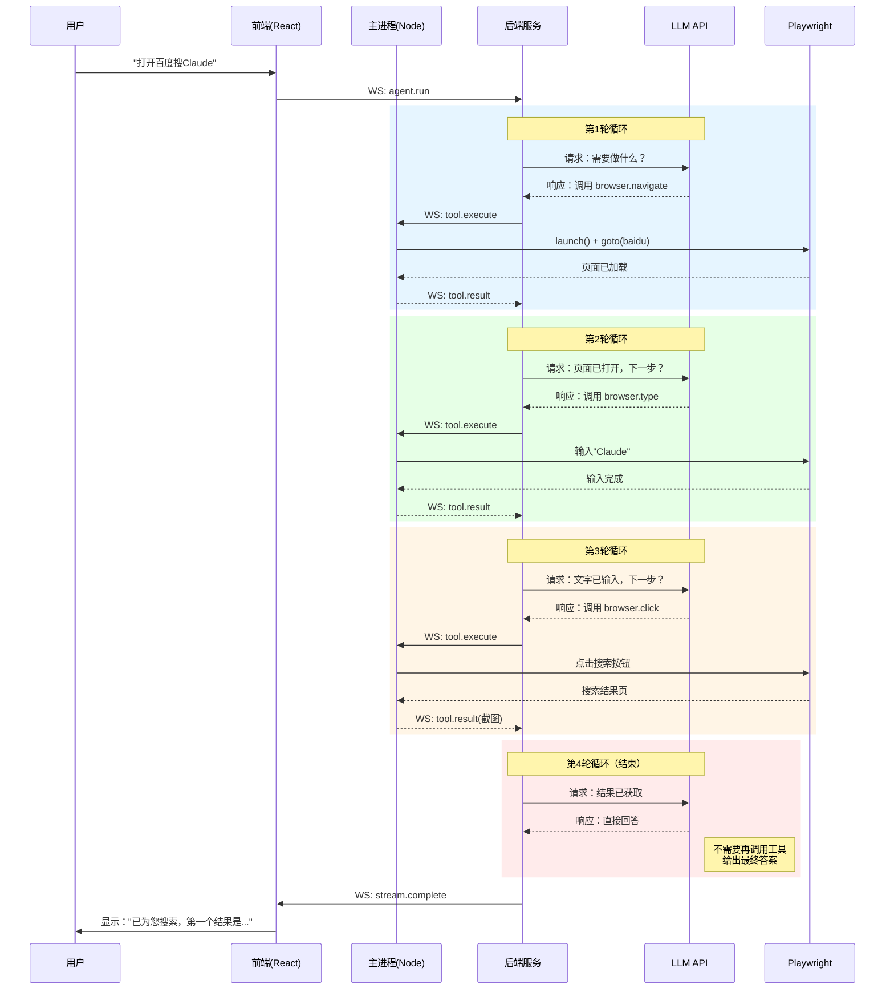

# 方案1：WebSocket 反向通道（Agent-loop 在后端）

> 详细技术方案：后端主导 Agent-loop，工具执行通过 WebSocket 反向调用客户端

## 1. 架构总览

```
┌─────────────────────────────────────────────────────────────────────────────┐
│                              系统架构图                                       │
├─────────────────────────────────────────────────────────────────────────────┤
│                                                                             │
│   ┌──────────────────────┐                    ┌─────────────────────────┐   │
│   │    Electron Desktop   │    WebSocket      │      Backend Server     │   │
│   │                      │   (双向实时通信)    │                         │   │
│   │  ┌────────────────┐  │◄─────────────────►│  ┌─────────────────────┐  │   │
│   │  │   渲染进程      │  │                   │  │   Agent Manager     │  │   │
│   │  │  (React UI)    │  │   1. 用户输入      │  │  - 用户会话管理      │  │   │
│   │  │                │  │   2. 流式输出      │  │  - 多会话支持        │  │   │
│   │  │  功能：         │  │   3. 状态同步      │  │  - 历史记录存储      │  │   │
│   │  │  - 多会话标签页  │  │                   │  └──────────┬──────────┘  │   │
│   │  │  - 消息展示     │  │                   │             │             │   │
│   │  │  - 浏览器预览   │  │                   │  ┌──────────▼──────────┐  │   │
│   │  └───────┬────────┘  │                   │  │    Agent Loop       │  │   │
│   │          │ IPC       │                   │  │  ┌───────────────┐  │  │   │
│   │  ┌───────▼────────┐  │                   │  │  │  ReAct 循环   │  │  │   │
│   │  │    主进程       │  │◄──────────────────│  │  │  - Observation│  │  │   │
│   │  │  (Node.js)     │  │   工具执行指令     │  │  │  - Thought    │  │  │   │
│   │  │                │  │                   │  │  │  - Action     │  │  │   │
│   │  │  功能：         │  │   执行结果返回    │  │  │  - Loop       │  │  │   │
│   │  │  - Playwright  │  │──────────────────►│  │  └───────────────┘  │  │   │
│   │  │  - 系统命令     │  │                   │  └──────────┬──────────┘  │   │
│   │  │  - 本地文件     │  │                   │             │             │   │
│   │  │  - WS 客户端   │  │                   │  ┌──────────▼──────────┐  │   │
│   │  └────────────────┘  │                   │  │   Tool Bridge       │  │   │
│   │                      │                   │  │  (工具调用代理层)    │  │   │
│   └──────────────────────┘                   │  └─────────────────────┘  │   │
│                                              └─────────────────────────────┘   │
│                                                                             │
│   ┌─────────────────────────────────────────────────────────────────────┐   │
│   │                          外部服务                                   │   │
│   │  ┌──────────────┐  ┌──────────────┐  ┌──────────────┐              │   │
│   │  │  Anthropic   │  │   OpenAI     │  │    千问      │              │   │
│   │  │   Claude     │  │    GPT       │  │  DashScope   │              │   │
│   │  └──────────────┘  └──────────────┘  └──────────────┘              │   │
│   └─────────────────────────────────────────────────────────────────────┘   │
│                                                                             │
└─────────────────────────────────────────────────────────────────────────────┘
```

## 2. 核心组件职责

### 2.1 Agent Loop（后端）

Agent Loop 是系统的决策中枢，负责 ReAct（Reasoning + Acting）循环。

```typescript
// apps/server/src/services/agent-loop.ts

interface AgentLoopConfig {
  maxIterations: number      // 最大循环次数，防止死循环
  model: string              // 使用的大模型
  systemPrompt: string       // 系统提示词
}

interface LoopState {
  sessionId: string
  status: 'idle' | 'running' | 'waiting_tool' | 'completed' | 'error'
  iteration: number
  messages: Message[]        // 完整对话历史
}

class AgentLoop {
  private state: LoopState
  private config: AgentLoopConfig
  private toolBridge: ToolBridge
  private eventEmitter: EventEmitter

  constructor(sessionId: string, config: AgentLoopConfig) {
    this.state = {
      sessionId,
      status: 'idle',
      iteration: 0,
      messages: []
    }
    this.config = config
    this.toolBridge = new ToolBridge(sessionId)
    this.eventEmitter = new EventEmitter()
  }

  /**
   * 核心循环：ReAct 范式
   * Observation -> Thought -> Action -> (Repeat)
   */
  async run(userInput: string): Promise<void> {
    // 初始化
    this.state.status = 'running'
    this.addMessage({ role: 'user', content: userInput })
    
    this.emit('run_start', { input: userInput })

    try {
      // ========== LOOP START ==========
      while (this.state.iteration < this.config.maxIterations) {
        this.state.iteration++
        
        this.emit('iteration_start', { 
          iteration: this.state.iteration 
        })

        // Step 1: Observation（构建上下文）
        const context = this.buildContext()
        
        // Step 2: Thought（LLM 思考）
        const llmResponse = await this.callLLM(context)
        
        // Step 3: 判断是 Action 还是 Final Answer
        if (llmResponse.toolCalls && llmResponse.toolCalls.length > 0) {
          // 需要执行工具（Action）
          this.state.status = 'waiting_tool'
          
          for (const toolCall of llmResponse.toolCalls) {
            // 通知前端工具开始执行
            this.emit('tool_start', { toolCall })
            
            // 执行工具（可能走 WebSocket 到客户端）
            const result = await this.executeTool(toolCall)
            
            // 添加工具结果到上下文（Observation）
            this.addToolResult(toolCall.id, result)
            
            // 通知前端工具执行完成
            this.emit('tool_end', { toolCall, result })
          }
          
          // LOOP CONTINUE: 带着工具结果继续循环
          continue
          
        } else {
          // 得到最终答案，结束循环
          this.addMessage({
            role: 'assistant',
            content: llmResponse.content
          })
          this.state.status = 'completed'
          this.emit('run_complete', { 
            output: llmResponse.content 
          })
          break
        }
      }
      // ========== LOOP END ==========

      // 超过最大迭代次数
      if (this.state.iteration >= this.config.maxIterations) {
        this.state.status = 'error'
        this.emit('run_error', { 
          error: 'Exceeded maximum iterations' 
        })
      }

    } catch (error) {
      this.state.status = 'error'
      this.emit('run_error', { error })
      throw error
    }
  }

  /**
   * 暂停循环（用户可手动暂停）
   */
  pause(): void {
    if (this.state.status === 'running') {
      this.state.status = 'paused'
      this.emit('run_paused')
    }
  }

  /**
   * 恢复循环
   */
  resume(): void {
    if (this.state.status === 'paused') {
      this.state.status = 'running'
      // 继续执行...
    }
  }

  private async executeTool(toolCall: ToolCall): Promise<ToolResult> {
    // 通过 Tool Bridge 执行工具
    // 如果是本地工具（browser/bash），会通过 WebSocket 发送到客户端
    return this.toolBridge.execute(toolCall)
  }

  private emit(event: string, data: any): void {
    this.eventEmitter.emit(event, {
      sessionId: this.state.sessionId,
      timestamp: Date.now(),
      ...data
    })
  }
}
```

### 2.2 Tool Bridge（工具代理层）

Tool Bridge 负责判断工具在哪里执行，并路由到正确的执行器。

```typescript
// apps/server/src/services/tool-bridge.ts

interface ToolCall {
  id: string
  name: string
  arguments: Record<string, any>
}

interface ToolResult {
  success: boolean
  data?: any
  error?: string
  executionTime: number
}

/**
 * 工具类型枚举
 */
enum ToolType {
  LOCAL = 'local',           // 必须在客户端执行（浏览器、系统命令）
  REMOTE = 'remote',         // 可在后端直接执行（API调用）
  HYBRID = 'hybrid'          // 两者皆可，优先本地
}

class ToolBridge {
  private sessionId: string
  private wsClient: WebSocketClient | null = null
  private remoteExecutors: Map<string, RemoteToolExecutor>

  constructor(sessionId: string) {
    this.sessionId = sessionId
    this.remoteExecutors = new Map()
    this.registerRemoteTools()
  }

  /**
   * 绑定 WebSocket 客户端（用于调用本地工具）
   */
  bindWebSocket(wsClient: WebSocketClient): void {
    this.wsClient = wsClient
  }

  /**
   * 执行工具的主入口
   */
  async execute(toolCall: ToolCall): Promise<ToolResult> {
    const toolType = this.classifyTool(toolCall.name)
    
    switch (toolType) {
      case ToolType.LOCAL:
        return this.executeLocalTool(toolCall)
        
      case ToolType.REMOTE:
        return this.executeRemoteTool(toolCall)
        
      case ToolType.HYBRID:
        // 优先尝试本地，如果客户端不在线则回退到远程
        if (this.wsClient?.isConnected()) {
          return this.executeLocalTool(toolCall)
        } else {
          return this.executeRemoteTool(toolCall)
        }
        
      default:
        throw new Error(`Unknown tool: ${toolCall.name}`)
    }
  }

  /**
   * 工具分类器
   */
  private classifyTool(toolName: string): ToolType {
    const localTools = ['browser', 'bash', 'file_read', 'file_write']
    const remoteTools = ['http_request', 'database_query', 'search_api']
    
    if (localTools.includes(toolName)) return ToolType.LOCAL
    if (remoteTools.includes(toolName)) return ToolType.REMOTE
    return ToolType.HYBRID
  }

  /**
   * 执行本地工具（通过 WebSocket 发送到客户端）
   */
  private async executeLocalTool(toolCall: ToolCall): Promise<ToolResult> {
    if (!this.wsClient || !this.wsClient.isConnected()) {
      return {
        success: false,
        error: 'Client offline, cannot execute local tool',
        executionTime: 0
      }
    }

    const startTime = Date.now()
    
    try {
      // 发送工具执行请求到客户端
      const result = await this.wsClient.request('tool.execute', {
        sessionId: this.sessionId,
        toolCall
      }, {
        timeout: 60000  // 工具执行超时时间
      })
      
      return {
        success: true,
        data: result,
        executionTime: Date.now() - startTime
      }
      
    } catch (error) {
      return {
        success: false,
        error: error instanceof Error ? error.message : 'Tool execution failed',
        executionTime: Date.now() - startTime
      }
    }
  }

  /**
   * 执行远程工具（在后端直接执行）
   */
  private async executeRemoteTool(toolCall: ToolCall): Promise<ToolResult> {
    const executor = this.remoteExecutors.get(toolCall.name)
    if (!executor) {
      return {
        success: false,
        error: `Remote tool ${toolCall.name} not found`,
        executionTime: 0
      }
    }
    
    return executor.execute(toolCall.arguments)
  }

  private registerRemoteTools(): void {
    // 注册可在后端执行的远程工具
    this.remoteExecutors.set('http_request', new HttpRequestTool())
    this.remoteExecutors.set('search_api', new SearchApiTool())
  }
}
```

### 2.3 WebSocket 协议设计

定义前后端通信的消息格式。

```typescript
// apps/server/src/types/websocket.ts

/**
 * 消息类型枚举
 */
export enum MessageType {
  // 连接管理
  CONNECT = 'connect',
  CONNECT_ACK = 'connect_ack',
  PING = 'ping',
  PONG = 'pong',
  DISCONNECT = 'disconnect',
  
  // 会话管理
  SESSION_CREATE = 'session.create',
  SESSION_CREATE_ACK = 'session.create_ack',
  SESSION_LIST = 'session.list',
  SESSION_SWITCH = 'session.switch',
  
  // Agent Loop 控制
  AGENT_RUN = 'agent.run',
  AGENT_PAUSE = 'agent.pause',
  AGENT_RESUME = 'agent.resume',
  AGENT_STOP = 'agent.stop',
  
  // 流式输出
  STREAM_CHUNK = 'stream.chunk',
  STREAM_COMPLETE = 'stream.complete',
  STREAM_ERROR = 'stream.error',
  
  // 工具执行（反向通道核心）
  TOOL_EXECUTE = 'tool.execute',           // 后端 -> 前端
  TOOL_EXECUTE_ACK = 'tool.execute_ack',   // 前端 -> 后端（确认收到）
  TOOL_PROGRESS = 'tool.progress',         // 前端 -> 后端（进度更新）
  TOOL_RESULT = 'tool.result',             // 前端 -> 后端（执行结果）
  TOOL_ERROR = 'tool.error',               // 前端 -> 后端（执行错误）
  
  // 状态同步
  STATE_SYNC = 'state.sync',
  STATE_UPDATE = 'state.update'
}

/**
 * WebSocket 消息基类
 */
export interface WSMessage {
  type: MessageType
  messageId: string      // 唯一消息ID，用于追踪
  timestamp: number
  sessionId?: string
  payload?: any
}

/**
 * 工具执行请求（后端 -> 前端）
 */
export interface ToolExecuteMessage extends WSMessage {
  type: MessageType.TOOL_EXECUTE
  payload: {
    toolCall: {
      id: string
      name: string
      arguments: Record<string, any>
    }
    timeout: number      // 执行超时时间（毫秒）
    requireAck: boolean  // 是否需要确认
  }
}

/**
 * 工具执行结果（前端 -> 后端）
 */
export interface ToolResultMessage extends WSMessage {
  type: MessageType.TOOL_RESULT
  payload: {
    toolCallId: string
    success: boolean
    data?: any
    error?: string
    executionTime: number
    metadata?: {
      screenshot?: string    // Base64 截图
      logs?: string[]        // 执行日志
    }
  }
}

/**
 * Agent 流式输出（后端 -> 前端）
 */
export interface StreamChunkMessage extends WSMessage {
  type: MessageType.STREAM_CHUNK
  payload: {
    content?: string       // 文本内容
    toolCall?: any         // 工具调用请求
    reasoning?: string     // 推理过程（如果有）
  }
}
```

### 2.4 客户端主进程（WebSocket 客户端）

```typescript
// apps/client/src/main/websocket-client.ts

import { WebSocket } from 'ws'

class WebSocketClient {
  private ws: WebSocket | null = null
  private reconnectAttempts = 0
  private maxReconnectAttempts = 5
  private pendingRequests = new Map<string, { resolve: Function, reject: Function }>()
  private toolExecutor: LocalToolExecutor

  constructor(private serverUrl: string) {
    this.toolExecutor = new LocalToolExecutor()
  }

  connect(): void {
    this.ws = new WebSocket(this.serverUrl)
    
    this.ws.on('open', () => {
      console.log('WebSocket connected')
      this.reconnectAttempts = 0
      
      // 发送连接认证
      this.send({
        type: 'connect',
        payload: {
          clientType: 'electron-main',
          version: app.getVersion(),
          authToken: this.getAuthToken()
        }
      })
    })

    this.ws.on('message', (data) => {
      const message = JSON.parse(data.toString())
      this.handleMessage(message)
    })

    this.ws.on('close', () => {
      console.log('WebSocket disconnected')
      this.attemptReconnect()
    })

    this.ws.on('error', (error) => {
      console.error('WebSocket error:', error)
    })
  }

  /**
   * 处理来自后端的消息
   */
  private async handleMessage(message: WSMessage): Promise<void> {
    switch (message.type) {
      case 'tool.execute':
        await this.handleToolExecute(message)
        break
        
      case 'ping':
        this.send({ type: 'pong' })
        break
        
      default:
        console.log('Unknown message type:', message.type)
    }
  }

  /**
   * 处理工具执行请求
   */
  private async handleToolExecute(message: ToolExecuteMessage): Promise<void> {
    const { toolCall, timeout } = message.payload
    
    try {
      // 发送确认
      this.send({
        type: 'tool.execute_ack',
        messageId: message.messageId,
        payload: { toolCallId: toolCall.id }
      })

      // 执行本地工具
      const result = await this.toolExecutor.execute(toolCall)
      
      // 返回结果
      this.send({
        type: 'tool.result',
        messageId: this.generateMessageId(),
        sessionId: message.sessionId,
        payload: {
          toolCallId: toolCall.id,
          success: true,
          data: result,
          executionTime: result.executionTime
        }
      })
      
    } catch (error) {
      // 返回错误
      this.send({
        type: 'tool.error',
        messageId: this.generateMessageId(),
        sessionId: message.sessionId,
        payload: {
          toolCallId: toolCall.id,
          success: false,
          error: error instanceof Error ? error.message : 'Unknown error'
        }
      })
    }
  }

  send(message: Partial<WSMessage>): void {
    if (this.ws?.readyState === WebSocket.OPEN) {
      this.ws.send(JSON.stringify(message))
    }
  }

  isConnected(): boolean {
    return this.ws?.readyState === WebSocket.OPEN
  }

  private attemptReconnect(): void {
    if (this.reconnectAttempts < this.maxReconnectAttempts) {
      this.reconnectAttempts++
      setTimeout(() => this.connect(), 1000 * this.reconnectAttempts)
    }
  }

  private generateMessageId(): string {
    return `${Date.now()}-${Math.random().toString(36).substr(2, 9)}`
  }

  private getAuthToken(): string {
    // 从本地存储获取登录 token
    return store.get('auth.token') || ''
  }
}

/**
 * 本地工具执行器
 */
class LocalToolExecutor {
  private browser: BrowserTool
  private bash: BashTool
  private file: FileTool

  constructor() {
    this.browser = new BrowserTool()
    this.bash = new BashTool()
    this.file = new FileTool()
  }

  async execute(toolCall: ToolCall): Promise<any> {
    const { name, arguments: args } = toolCall
    
    switch (name) {
      case 'browser':
        return this.browser.execute(args)
      case 'bash':
        return this.bash.execute(args)
      case 'file_read':
      case 'file_write':
        return this.file.execute(name, args)
      default:
        throw new Error(`Unknown local tool: ${name}`)
    }
  }
}
```

## 3. 完整数据流示例

### 场景：用户说"打开百度搜索 Claude"

```
┌──────────┐     ┌──────────┐     ┌──────────┐     ┌──────────┐     ┌──────────┐
│   用户   │────►│   前端   │────►│   后端   │────►│  LLM API │     │  浏览器  │
└──────────┘     └──────────┘     └──────────┘     └──────────┘     └──────────┘
    │                │                │                │                │
    │ "打开百度搜Claude"               │                │                │
    │───────────────►│                │                │                │
    │                │  1. 发送消息    │                │                │
    │                │  WS: agent.run  │                │                │
    │                │───────────────►│                │                │
    │                │                │  2. 创建/获取   │                │
    │                │                │  AgentLoop     │                │
    │                │                │                │                │
    │                │                │  3. 调用 LLM   │                │
    │                │                │  (第1轮思考)    │                │
    │                │                │───────────────►│                │
    │                │                │                │                │
    │                │                │  4. LLM 返回   │                │
    │                │                │  tool_call:    │                │
    │                │                │  browser.navigate
    │                │                │◄───────────────│                │
    │                │                │                │                │
    │                │                │  5. 发送工具   │                │
    │                │                │  执行指令      │                │
    │                │                │  WS: tool.execute
    │                │                │───────────────►│ (WebSocket     │
    │                │◄───────────────│                │  到客户端主进程)│
    │                │                │                │                │
    │                │  6. 主进程执行  │                │                │
    │                │  Playwright    │                │                │
    │                │  - launch()    │                │                │
    │                │  - goto(baidu) │                │                │
    │                │                │                │                │
    │                │  7. 截图+返回   │                │                │
    │                │  WS: tool.result│                │                │
    │                │───────────────►│                │                │
    │                │                │                │                │
    │                │                │  8. 添加结果   │                │
    │                │                │  到上下文      │                │
    │                │                │                │                │
    │                │                │  9. 再次调用   │                │
    │                │                │  LLM (第2轮)   │                │
    │                │                │───────────────►│                │
    │                │                │                │                │
    │                │                │  10. LLM 返回  │                │
    │                │                │  tool_call:    │                │
    │                │                │  browser.type  │                │
    │                │                │  (输入"Claude") │                │
    │                │                │◄───────────────│                │
    │                │                │                │                │
    │                │                │  ... (继续循环) │                │
    │                │                │                │                │
    │                │                │  N. 最终回答   │                │
    │                │                │  "已为您搜索   │                │
    │                │                │   第一个结果   │                │
    │                │                │   是..."       │                │
    │                │                │                │                │
    │                │  WS: stream.complete              │                │
    │                │◄───────────────│                │                │
    │                │                │                │                │
    │ 显示结果        │                │                │                │
    │◄───────────────│                │                │                │
```

## 4. 时序图：多轮工具调用



## 5. 状态管理

### 5.1 会话状态机

```
┌─────────┐    run()    ┌──────────┐    工具调用    ┌─────────────┐
│  idle   │ ──────────► │ running  │ ────────────► │ waiting_tool│
└────┬────┘             └────┬─────┘               └──────┬──────┘
     │                       │                            │
     │                       │ pause()                    │
     │                       ▼                            │
     │                   ┌─────────┐                      │
     └──────────────────►│ paused  │◄─────────────────────┘
                         └────┬────┘  工具执行完成
                              │ resume()
                              ▼
                         ┌──────────┐
                         │ running  │
                         └────┬─────┘
                              │ 完成/错误
                              ▼
                    ┌─────────────────────┐
                    │   completed/error   │
                    └─────────────────────┘
```

### 5.2 消息存储格式

```typescript
// 存储在数据库中的会话记录
interface SessionRecord {
  id: string                    // 会话ID
  userId: string                // 用户ID
  title: string                 // 会话标题（可AI生成）
  createdAt: Date
  updatedAt: Date
  messages: Array<{
    id: string
    role: 'user' | 'assistant' | 'tool'
    content: string
    toolCalls?: ToolCall[]       // AI 请求的工具调用
    toolResults?: ToolResult[]   // 工具执行结果
    timestamp: Date
  }>
  metadata: {
    model: string                // 使用的模型
    totalTokens: number          // 总token消耗
    toolUsageCount: number       // 工具调用次数
  }
}
```

## 6. 错误处理

### 6.1 错误类型

| 错误类型 | 发生位置 | 处理策略 |
|---------|---------|---------|
| `CLIENT_OFFLINE` | 工具执行时 | 提示用户"需要客户端在线"或降级到远程工具 |
| `TOOL_TIMEOUT` | 工具执行超时 | 中止当前工具，询问用户是否继续 |
| `LLM_ERROR` | LLM API 调用 | 重试3次，失败后提示用户 |
| `LOOP_TIMEOUT` | 循环次数超限 | 结束循环，返回已收集的结果 |
| `WEBSOCKET_ERROR` | 连接断开 | 自动重连，恢复会话状态 |

### 6.2 错误恢复机制

```typescript
class AgentLoop {
  private async handleError(error: AgentError): Promise<void> {
    switch (error.type) {
      case 'CLIENT_OFFLINE':
        // 尝试使用远程替代方案
        if (this.canFallbackToRemote(error.toolName)) {
          return this.fallbackToRemote(error)
        }
        // 否则暂停等待用户
        this.pause()
        this.emit('waiting_client', { message: '请保持客户端在线' })
        break
        
      case 'TOOL_TIMEOUT':
        this.emit('tool_timeout', { toolCall: error.toolCall })
        // 询问用户是否继续
        break
        
      case 'LLM_ERROR':
        if (this.retryCount < 3) {
          this.retryCount++
          await this.delay(1000 * this.retryCount)
          return this.run(this.lastInput)
        }
        throw error
        
      default:
        this.state.status = 'error'
        this.emit('run_error', { error })
    }
  }
}
```

## 7. 性能优化

### 7.1 连接池

```typescript
// 后端管理 WebSocket 连接
class ConnectionPool {
  private connections = new Map<string, WebSocketConnection>()
  
  getConnection(userId: string): WebSocketConnection | undefined {
    return this.connections.get(userId)
  }
  
  // 心跳检测
  startHeartbeat(): void {
    setInterval(() => {
      this.connections.forEach((conn, userId) => {
        if (!conn.isAlive) {
          this.connections.delete(userId)
          // 标记 Agent 为离线模式
          this.agentManager.setOffline(userId)
        }
        conn.ping()
      })
    }, 30000)
  }
}
```

### 7.2 流式输出优化

```typescript
// 使用 SSE 或 WebSocket 流式推送
class StreamManager {
  async streamResponse(
    sessionId: string, 
    generator: AsyncGenerator<string>
  ): Promise<void> {
    const ws = this.getConnection(sessionId)
    
    for await (const chunk of generator) {
      ws.send({
        type: 'stream.chunk',
        payload: { content: chunk }
      })
    }
    
    ws.send({
      type: 'stream.complete'
    })
  }
}
```

## 8. 部署架构

```
生产环境
┌─────────────────────────────────────────────────────────────┐
│                        负载均衡器 (Nginx)                    │
└────────────────────┬────────────────────────────────────────┘
                     │
        ┌────────────┼────────────┐
        ▼            ▼            ▼
┌──────────────┐ ┌──────────┐ ┌──────────────┐
│ 后端实例 1   │ │ 后端实例2│ │  后端实例 N  │
│  (Agent)     │ │  (Agent) │ │   (Agent)    │
└──────┬───────┘ └────┬─────┘ └──────┬───────┘
       │              │              │
       └──────────────┼──────────────┘
                      ▼
            ┌──────────────────┐
            │     Redis        │
            │  - 会话状态      │
            │  - WebSocket订阅 │
            │  - 分布式锁      │
            └──────────────────┘
                      │
                      ▼
            ┌──────────────────┐
            │   PostgreSQL     │
            │  - 用户数据      │
            │  - 历史记录      │
            │  - 审计日志      │
            └──────────────────┘
```

## 9. 开发检查清单

### 后端实现
- [ ] AgentLoop 核心循环逻辑
- [ ] ToolBridge 工具路由
- [ ] WebSocket 服务器（使用 `ws` 库）
- [ ] 会话管理（多用户、多会话）
- [ ] 消息持久化（PostgreSQL）
- [ ] 流式输出支持
- [ ] 错误处理和恢复
- [ ] 日志和监控

### 客户端实现
- [ ] 主进程 WebSocket 客户端
- [ ] 本地工具执行器（Playwright、Bash）
- [ ] IPC 通信（主进程 ↔ 渲染进程）
- [ ] 重连机制
- [ ] 离线检测

### 前端实现
- [ ] WebSocket 连接管理
- [ ] 多会话 UI（标签页）
- [ ] 流式消息展示
- [ ] 工具执行状态显示
- [ ] 浏览器预览窗口

---

*文档创建时间：2026-05-14*
