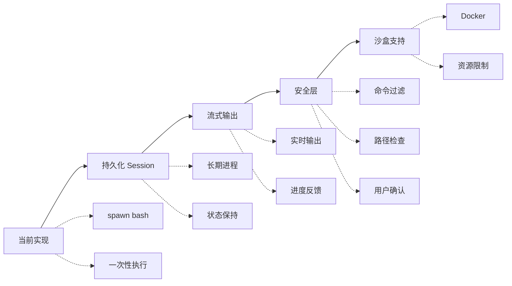

# Bash 工具设计方案

## 1. 市面上主流方案分析

### 1.1 Anthropic Computer Use (官方标杆)

**架构设计：**
```
┌─────────────────┐     MCP Protocol      ┌──────────────────┐
│   Claude API    │ ◄────────────────────► │  Bash MCP Server │
│                 │                        │                  │
│  - Tool Schema  │                        │  - Shell Session │
│  - Streaming    │                        │  - Sandbox       │
│  - Vision Input │                        │  - File Access   │
└─────────────────┘                        └──────────────────┘
```

**核心特性：**
- **持久化 Shell Session**: 支持 `cd` 等状态命令
- **JSON Schema 定义**: 严格的工具参数规范
- **流式输出**: 实时返回命令执行进度
- **安全沙箱**: Docker/container 隔离执行
- **文件系统权限**: 可配置的允许/拒绝路径

**工具定义示例：**
```json
{
  "name": "bash",
  "description": "Execute bash commands...",
  "input_schema": {
    "type": "object",
    "properties": {
      "command": { "type": "string" },
      "timeout": { "type": "number", "default": 60000 },
      "restart": { "type": "boolean", "default": false }
    },
    "required": ["command"]
  }
}
```

**优点：**
- 标准化 MCP 协议
- 企业级安全设计
- 完善的文档和生态

**缺点：**
- 需要额外部署 MCP Server
- 配置较复杂

---

### 1.2 Claude Code (官方 CLI)

**架构设计：**
```
┌─────────────┐      Stdio        ┌──────────────┐
│ Claude Code │ ◄────────────────► │ Shell Server │
│   (Node)    │                    │  (Child Proc)│
└─────────────┘                    └──────────────┘
         │                                │
         │         Git Context            │
         └────────────────────────────────┘
```

**核心特性：**
- **深度 Git 集成**: 自动检测 git 状态、提交历史
- **项目上下文**: 自动读取 README、package.json
- **智能补全**: 命令行智能提示和补全
- **状态持久化**: 跨会话保持 shell 状态
- **TUI 界面**: 终端用户界面，支持交互式编辑

**实现亮点：**
```typescript
class ShellSession {
  private process: ChildProcess
  private buffer: string = ''
  private state: 'idle' | 'running' | 'error' = 'idle'

  async execute(command: string, options: ExecuteOptions): Promise<ExecuteResult> {
    // 1. 命令安全校验
    if (this.isDangerous(command)) {
      throw new SecurityError('Command blocked by policy')
    }

    // 2. 发送命令到持久化 shell
    this.process.stdin.write(command + '\n')

    // 3. 流式读取输出
    return new Promise((resolve) => {
      const timeout = setTimeout(() => {
        resolve({ success: false, error: 'Timeout' })
      }, options.timeout)

      this.process.stdout?.on('data', (data) => {
        this.buffer += data.toString()
        // 检测命令结束标记
        if (this.isCommandComplete()) {
          clearTimeout(timeout)
          resolve({ success: true, output: this.buffer })
        }
      })
    })
  }
}
```

**优点：**
- 用户体验极佳
- 开箱即用
- 针对编程场景优化

**缺点：**
- 与 Claude Code 深度耦合
- 难以独立使用

---

### 1.3 OpenClaw (开源方案)

**架构设计：**
```
┌─────────────────┐
│   OpenClaw      │
│                 │
│  ┌───────────┐  │
│  │ Bash Tool │  │  Local Execution
│  │           │  │  No isolation
│  │ - spawn() │  │
│  │ - streams │  │
│  └───────────┘  │
└─────────────────┘
```

**核心特性：**
- **简单直接**: 使用 Node.js child_process
- **无依赖**: 不依赖 Docker 或其他运行时
- **本地执行**: 直接在当前环境执行
- **基础超时**: 简单的超时机制

**实现：**
```typescript
export class BashTool {
  async execute(args: { command: string; timeout?: number }) {
    const { command, timeout = 30000 } = args
    
    return new Promise((resolve, reject) => {
      const child = spawn('bash', ['-c', command])
      
      let stdout = ''
      let stderr = ''
      
      const timer = setTimeout(() => {
        child.kill()
        reject(new Error('Timeout'))
      }, timeout)
      
      child.stdout.on('data', (data) => stdout += data)
      child.stderr.on('data', (data) => stderr += data)
      
      child.on('close', (code) => {
        clearTimeout(timer)
        resolve({ stdout, stderr, exitCode: code })
      })
    })
  }
}
```

**优点：**
- 实现简单
- 无额外依赖
- 快速启动

**缺点：**
- 无安全隔离
- 无持久化 session
- 不支持 cd

---

### 1.4 OpenAI Codex CLI

**架构设计：**
```
┌─────────────────┐     Agents SDK      ┌──────────────────┐
│   Codex CLI     │ ◄──────────────────► │  Function Calling│
│                 │                        │                  │
│  - Approval UI  │                        │  - Bash          │
│  - Sandbox      │                        │  - File Edit     │
│  - Git Commit   │                        │  - Web Search    │
└─────────────────┘                        └──────────────────┘
```

**核心特性：**
- **函数调用**: 使用 OpenAI Function Calling
- **沙盒执行**: 可选的 sandbox 模式
- **人工确认**: 敏感操作需要用户确认
- **Git 集成**: 自动提交和回滚
- **网络搜索**: 可联网获取最新信息

**安全模型：**
```typescript
interface SecurityPolicy {
  readonlyMode: boolean      // 只读模式
  networkAccess: boolean     // 网络访问
  fileWritePaths: string[]   // 允许写入的路径
  dangerousCommands: string[] // 危险命令列表
}

class SecureExecutor {
  async execute(command: string, policy: SecurityPolicy) {
    // 1. 检查危险命令
    if (this.isDangerous(command, policy.dangerousCommands)) {
      await this.requestApproval(command)
    }
    
    // 2. 在沙盒中执行
    if (policy.readonlyMode) {
      return this.executeInSandbox(command)
    }
    
    // 3. 本地执行
    return this.executeLocal(command)
  }
}
```

**优点：**
- 分层安全设计
- 用户可控
- 与 OpenAI 生态集成

**缺点：**
- 依赖 OpenAI API
- 沙盒配置复杂

---

### 1.5 Aider (编程助手)

**架构设计：**
```
┌─────────────────┐
│      Aider      │
│                 │
│  ┌───────────┐  │     Repository Context
│  │ Git Repo  │◄─├─────────────────────────
│  └─────┬─────┘  │
│        │        │
│  ┌─────▼─────┐  │
│  │ Code Edit │  │  Structured Editing
│  │ - Search  │  │  - Find/Replace
│  │ - Replace │  │  - Unified Diff
│  └───────────┘  │
└─────────────────┘
```

**核心特性：**
- **结构化编辑**: 不是执行 bash，而是直接代码编辑
- **Git 感知**: 所有修改基于 git 上下文
- **多文件**: 支持跨文件修改
- **Lint 集成**: 自动检测语法错误

**编辑方式对比：**
| 方式 | Aider | Bash |
|-----|-------|------|
| 文件修改 | 结构化搜索替换 | echo/cat |
| 大文件 | 精确行号编辑 | 流式处理 |
| 多文件 | 批量操作 | 循环脚本 |
| 回滚 | git 直接回滚 | 手动恢复 |

**优点：**
- 精确控制代码修改
- 天然支持回滚
- 适合编程场景

**缺点：**
- 不适合通用系统操作
- 需要理解代码结构

---

## 2. 方案对比矩阵

| 特性 | Anthropic CU | Claude Code | OpenClaw | Codex CLI | Aider |
|-----|-------------|-------------|----------|-----------|-------|
| **协议** | MCP | 私有 | 私有 | Function Call | 私有 |
| **持久化 Session** | ✅ | ✅ | ❌ | ✅ | N/A |
| **安全沙盒** | ✅ | ⚠️ | ❌ | ✅ | N/A |
| **流式输出** | ✅ | ✅ | ❌ | ✅ | ❌ |
| **Git 集成** | ❌ | ✅ | ❌ | ✅ | ✅ |
| **人工确认** | 配置 | ⚠️ | ❌ | ✅ | ❌ |
| **开源** | ✅ | ❌ | ✅ | ✅ | ✅ |
| **易用性** | 中 | 高 | 高 | 中 | 中 |
| **适用场景** | 企业 | 编程 | 简单 | 通用 | 编程 |

**图例：** ✅ 支持 ❌ 不支持 ⚠️ 有限支持

---

## 3. 推荐设计方案

### 3.1 架构选择：分层设计

```
┌─────────────────────────────────────────────────────────────┐
│                    Bash Tool Architecture                   │
├─────────────────────────────────────────────────────────────┤
│                                                             │
│  ┌─────────────────┐    Session API     ┌─────────────────┐ │
│  │   Agent Loop    │ ◄────────────────► │  Shell Session  │ │
│  │   (Server)      │                    │   Manager       │ │
│  └─────────────────┘                    └────────┬────────┘ │
│                                                  │          │
│                          ┌───────────────────────┼──────┐   │
│                          │                       │      │   │
│              ┌───────────▼──────────┐ ┌──────────▼───┐  │   │
│              │   Local Session      │ │  Sandbox     │  │   │
│              │   (Child Process)    │ │  (Docker)    │  │   │
│              │                      │ │              │  │   │
│              │  - cd support        │ │  - Isolated  │  │   │
│              │  - Env variables     │ │  - Secure    │  │   │
│              │  - Background jobs   │ │  - Limited   │  │   │
│              └──────────────────────┘ └──────────────┘  │   │
│                                                          │   │
│  ┌───────────────────────────────────────────────────────┘   │
│  │                    Security Layer                         │
│  │  ┌──────────┐  ┌──────────┐  ┌──────────┐               │
│  │  │  Command │  │  Path    │  │  Network │               │
│  │  │  Filter  │  │  Check   │  │  Block   │               │
│  │  └──────────┘  └──────────┘  └──────────┘               │
│  └──────────────────────────────────────────────────────────┘
│                                                             │
└─────────────────────────────────────────────────────────────┘
```

### 3.2 核心功能设计

#### Phase 1: 基础功能 (当前实现)

```typescript
// 当前基础实现
class BashTool {
  async execute(args: BashInput): Promise<BashOutput>
}
```

**特性：**
- 简单命令执行
- 基础超时
- 输出捕获

---

#### Phase 2: 持久化 Session (推荐实现)

```typescript
interface ShellSession {
  id: string
  process: ChildProcess
  cwd: string
  env: Record<string, string>
  history: CommandHistory[]
}

class ShellSessionManager {
  private sessions = new Map<string, ShellSession>()
  
  // 创建/获取会话
  getOrCreate(sessionId: string): ShellSession
  
  // 执行命令（支持 cd）
  async execute(sessionId: string, command: string): Promise<ExecuteResult>
  
  // 销毁会话
  destroy(sessionId: string): void
}
```

**关键改进：**
```typescript
// 1. 持久化进程
const shell = spawn('bash', [], {
  stdio: ['pipe', 'pipe', 'pipe']
})

// 2. 状态跟踪
shell.on('data', (data) => {
  // 使用 PS1 标记检测命令完成
  if (data.includes('__CMD_END__')) {
    resolve(output)
  }
})

// 3. 支持 cd
shell.stdin.write('cd /some/path && pwd\n')
// 后续命令继承这个 cwd
```

---

#### Phase 3: 安全层 (生产必需)

```typescript
interface SecurityPolicy {
  // 命令白名单/黑名单
  allowedCommands?: string[]
  blockedCommands: string[]
  
  // 路径限制
  allowedPaths: string[]
  blockedPaths: string[]
  
  // 网络限制
  networkAccess: boolean
  allowedHosts?: string[]
  
  // 资源限制
  maxExecutionTime: number
  maxMemoryMB: number
  maxOutputSize: number
  
  // 确认机制
  requireConfirmation: boolean
  confirmationThreshold: 'low' | 'medium' | 'high'
}

class SecureBashExecutor {
  async execute(command: string, policy: SecurityPolicy) {
    // 1. 命令解析
    const parsed = this.parseCommand(command)
    
    // 2. 危险等级评估
    const riskLevel = this.assessRisk(parsed)
    
    // 3. 用户确认（高风险）
    if (policy.requireConfirmation && riskLevel >= policy.confirmationThreshold) {
      const approved = await this.requestUserConfirmation(command, riskLevel)
      if (!approved) throw new Error('User declined')
    }
    
    // 4. 路径检查
    if (!this.isPathAllowed(parsed, policy)) {
      throw new SecurityError('Path not allowed')
    }
    
    // 5. 在沙盒中执行
    return this.sandbox.execute(command, {
      timeout: policy.maxExecutionTime,
      memory: policy.maxMemoryMB,
      network: policy.networkAccess
    })
  }
}
```

---

### 3.3 工具接口设计

```typescript
// apps/client/src/main/tools/bash.ts

export interface BashInput {
  /** 命令 */
  command: string
  /** 工作目录 */
  working_dir?: string
  /** 超时（毫秒） */
  timeout?: number
  /** 环境变量 */
  env?: Record<string, string>
  /** 是否重启会话 */
  restart?: boolean
}

export interface BashOutput {
  /** 标准输出 */
  stdout: string
  /** 标准错误 */
  stderr: string
  /** 退出码 */
  exit_code: number
  /** 执行时长 */
  execution_time: number
  /** 当前工作目录（执行后） */
  current_dir?: string
}

export class BashTool {
  name = 'bash'
  
  description = `Execute bash commands in a persistent shell session.

Capabilities:
- Run shell commands (ls, cat, grep, etc.)
- File operations (read, write, search)
- Process management (ps, kill)
- Package management (npm, pip, etc.)
- Git operations

The session persists between calls, so 'cd' and environment variables work as expected.

Examples:
- List files: {"command": "ls -la"}
- Search code: {"command": "grep -r 'TODO' src/"}
- Check git status: {"command": "git status"}
- Install package: {"command": "npm install lodash"}
`

  input_schema = {
    type: 'object' as const,
    properties: {
      command: {
        type: 'string',
        description: 'The bash command to execute'
      },
      working_dir: {
        type: 'string',
        description: 'Working directory (optional, defaults to current)'
      },
      timeout: {
        type: 'number',
        description: 'Timeout in milliseconds (default: 60000)',
        default: 60000,
        minimum: 1000,
        maximum: 300000
      },
      env: {
        type: 'object',
        description: 'Additional environment variables',
        additionalProperties: { type: 'string' }
      },
      restart: {
        type: 'boolean',
        description: 'Restart the shell session (clears all state)',
        default: false
      }
    },
    required: ['command']
  }

  async execute(args: BashInput): Promise<BashOutput>
}
```

---

### 3.4 实现路线图



---

## 4. 与现有代码的集成

当前代码已实现 **Phase 1** 基础功能。

**建议下一步：**
1. 实现 **Phase 2** 持久化 Session（解决 cd 不生效问题）
2. 添加基础安全层（危险命令检查）
3. 可选：流式输出支持

**不需要 Phase 3-4 的场景：**
- 本地开发环境
- 受信任的用户
- 快速原型验证

**需要 Phase 3-4 的场景：**
- 生产环境
- 多用户共享
- 执行不受信任的代码

需要我详细实现 Phase 2 的代码吗？
