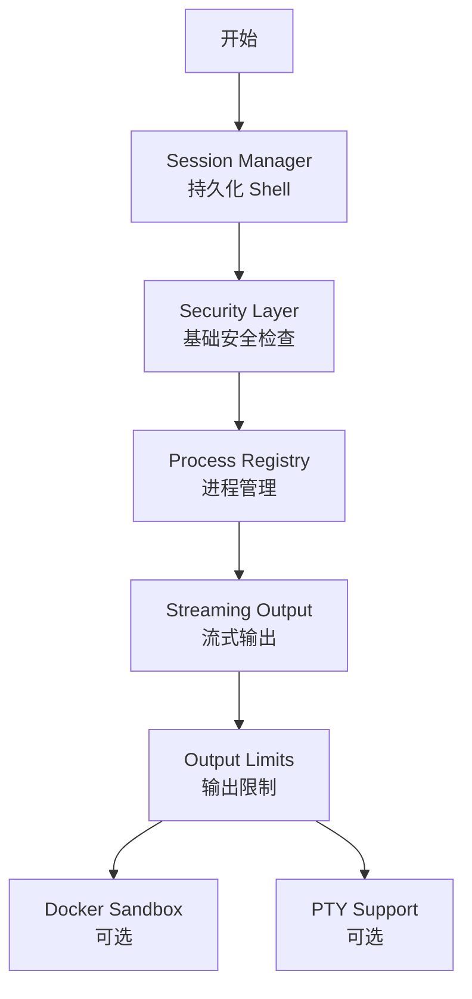

# OpenClaw Bash 工具方案分析与落地计划

## 一、OpenClaw 方案核心特性分析

OpenClaw 的方案是一个**企业级、生产环境**的 Bash 工具实现，包含以下核心模块：

| 模块 | 复杂度 | 适用场景 | 我们的需求 |
|-----|-------|---------|-----------|
| **持久化 Session** | 中 | 支持 cd、环境变量 | ✅ 必需 |
| **安全审批系统** | 高 | 多用户、生产环境 | ⚠️ 简化版 |
| **三主机架构** | 高 | 分布式执行 | ❌ 暂不需要 |
| **PTY 支持** | 高 | 交互式 CLI | ⚠️ 可选 |
| **脚本预检** | 中 | 防止 LLM 错误 | ⚠️ 可选 |
| **后台进程管理** | 中 | 长时间任务 | ✅ 推荐 |
| **环境变量安全** | 中 | 安全隔离 | ✅ 推荐 |

---

## 二、功能分级建议

### 🔴 Phase 1: 核心功能（必须实现）

适合当前阶段，解决核心痛点：

#### 1. 持久化 Shell Session
**解决什么问题：**
- 当前 `cd` 命令不生效（每次 spawn 新进程）
- 环境变量无法保持
- 无法支持后台任务

**OpenClaw 实现：** `bash-process-registry.ts` + 长期运行的 bash 进程

**我们的简化版：**
```typescript
class ShellSessionManager {
  private sessions = new Map<string, ShellSession>()
  
  getOrCreate(sessionId: string): ShellSession {
    if (!this.sessions.has(sessionId)) {
      // 创建持久化 bash 进程
      const session = new ShellSession(sessionId)
      this.sessions.set(sessionId, session)
    }
    return this.sessions.get(sessionId)!
  }
}

class ShellSession {
  private process: ChildProcess
  private currentDir: string
  
  async execute(command: string): Promise<ExecResult> {
    // 使用 PS1 标记检测命令完成
    const marker = `__CMD_END_${Date.now()}__`
    this.process.stdin.write(`${command}; echo "${marker}"\n`)
    
    // 等待标记输出
    return this.waitForMarker(marker)
  }
}
```

**工作量：** 1-2 天

---

#### 2. 基础安全层
**解决什么问题：**
- 防止执行危险命令（rm -rf /）
- 限制可访问的路径
- 防止环境变量劫持

**OpenClaw 实现：** 复杂的 allowlist + durable approval + inline eval 检测

**我们的简化版：**
```typescript
interface SecurityPolicy {
  blockedCommands: string[]     // 黑名单
  allowedPaths: string[]        // 允许的路径
  maxExecutionTime: number      // 超时
  requireConfirmation: boolean  // 危险命令确认
}

class SecureExecutor {
  private dangerousPatterns = [
    /rm\s+-rf\s+\/\s*$/,
    />\s*\/dev\/sda/,
    /dd\s+if=.*of=\//,
    /:\(\)\{\s*:\|:\s*\};/  // Fork bomb
  ]
  
  async execute(command: string, policy: SecurityPolicy) {
    // 1. 黑名单检查
    if (this.isBlocked(command)) {
      throw new SecurityError('Dangerous command blocked')
    }
    
    // 2. 路径检查
    if (!this.isPathAllowed(command, policy.allowedPaths)) {
      throw new SecurityError('Path not allowed')
    }
    
    // 3. 用户确认（危险操作）
    if (this.requiresConfirmation(command, policy)) {
      const confirmed = await this.showConfirmationDialog(command)
      if (!confirmed) throw new Error('User cancelled')
    }
    
    // 4. 执行
    return this.run(command, { timeout: policy.maxExecutionTime })
  }
}
```

**工作量：** 1 天

---

#### 3. 基础进程管理
**解决什么问题：**
- 支持长时间运行的任务（如 npm install）
- 会话结束时清理进程
- 查看运行中的任务

**OpenClaw 实现：** 完整的 ProcessRegistry + ProcessSupervisor

**我们的简化版：**
```typescript
class ProcessRegistry {
  private processes = new Map<string, ManagedProcess>()
  
  register(id: string, process: ChildProcess) {
    this.processes.set(id, {
      process,
      startTime: Date.now(),
      stdout: [],
      stderr: []
    })
    
    // 自动清理
    process.on('exit', () => {
      setTimeout(() => this.processes.delete(id), 5 * 60 * 1000) // 5分钟后清理
    })
  }
  
  // 会话结束时清理
  cleanupSession(sessionId: string) {
    for (const [id, proc] of this.processes) {
      if (id.startsWith(sessionId)) {
        proc.process.kill('SIGTERM')
      }
    }
  }
}
```

**工作量：** 0.5 天

---

### 🟡 Phase 2: 增强功能（推荐实现）

提升用户体验，但非阻塞：

#### 4. 流式输出
**OpenClaw 实现：** 完整的流式更新机制

**我们的版本：**
```typescript
// 支持实时输出到前端
class StreamingExecutor {
  async execute(command: string, onOutput: (chunk: string) => void) {
    const process = spawn('bash', ['-c', command])
    
    process.stdout.on('data', (data) => {
      onOutput(data.toString())
    })
    
    process.stderr.on('data', (data) => {
      onOutput(`[stderr] ${data.toString()}`)
    })
  }
}
```

**工作量：** 0.5 天

---

#### 5. 输出限制
**OpenClaw 实现：** 多层限制（pending max、aggregated max）

**我们的简化版：**
```typescript
const MAX_OUTPUT = 200000  // 20万字符

if (output.length > MAX_OUTPUT) {
  output = output.substring(0, MAX_OUTPUT) + '\n... (truncated)'
}
```

**工作量：** 0.5 天

---

### 🟢 Phase 3: 高级功能（可延后）

生产环境或特定场景需要：

#### 6. Docker Sandbox
**OpenClaw：** 完整的沙箱支持

**我们：** 如果需要高安全性，后续可添加

**工作量：** 3-5 天

---

#### 7. PTY 支持（交互式程序）
**OpenClaw：** 完整的伪终端支持

**我们：** 如果需要运行 vim、top 等交互式程序

**工作量：** 2-3 天

---

#### 8. 复杂的审批系统
**OpenClaw：** durable approval + 持久化 + 回调机制

**我们：** 桌面应用可以用简单的确认对话框替代

**工作量：** 如果不做，节省 2-3 天

---

#### 9. 远程 Node 执行
**OpenClaw：** 分布式执行架构

**我们：** 单机桌面应用暂不需要

**工作量：** 5-7 天

---

## 三、推荐实现方案

### 3.1 最终功能清单

```typescript
// 我们的 Bash Tool 能力
interface BashToolCapabilities {
  // Phase 1 (必须)
  persistentSession: true      // 持久化 shell，支持 cd
  basicSecurity: true          // 黑名单 + 路径限制 + 确认
  processManagement: true      // 后台任务管理
  
  // Phase 2 (推荐)
  streaming: true              // 实时输出
  outputLimit: true            // 输出截断
  
  // Phase 3 (延后)
  dockerSandbox: false         // 暂不实现
  pty: false                   // 暂不实现
  complexApproval: false       // 简化确认对话框
  remoteNode: false            // 单机版不需要
}
```

---

### 3.2 与现有代码集成

```
apps/client/src/main/tools/
├── bash/
│   ├── index.ts                    # 统一入口
│   ├── bash-tool.ts                # 主工具类
│   ├── session-manager.ts          # 会话管理（新增）
│   ├── security.ts                 # 安全检查（新增）
│   └── types.ts                    # 类型定义
├── browser/                        # 未来同理
└── index.ts                        # 工具注册
```

---

### 3.3 实现优先级



**建议顺序：**
1. **本周：** B + C（核心功能，3天）
2. **下周：** D + E + F（增强功能，2天）
3. **未来：** G + H（根据需要）

---

## 四、与 OpenClaw 的对比总结

| 特性 | OpenClaw | 我们的方案 | 差异原因 |
|-----|---------|-----------|---------|
| **架构** | 分布式 (sandbox/gateway/node) | 单机 | 桌面应用场景 |
| **安全** | 企业级 (allowlist + durable approval) | 基础安全 | 单用户、本地执行 |
| **Session** | 完整生命周期管理 | 会话级管理 | 与会话系统绑定 |
| **PTY** | 完整终端模拟 | 暂不实现 | 优先非交互式场景 |
| **审批** | 异步审批系统 | 同步确认对话框 | 简化用户体验 |
| **后台任务** | 完整 registry + followup | 简化 registry | 单机场景足够 |

---

## 五、下一步行动

需要我实现 **Phase 1** 的核心功能吗？

1. **Session Manager** - 持久化 shell，解决 cd 问题
2. **Security Layer** - 危险命令检查、路径限制
3. **Process Registry** - 后台进程管理

预计工作量：**3天**
